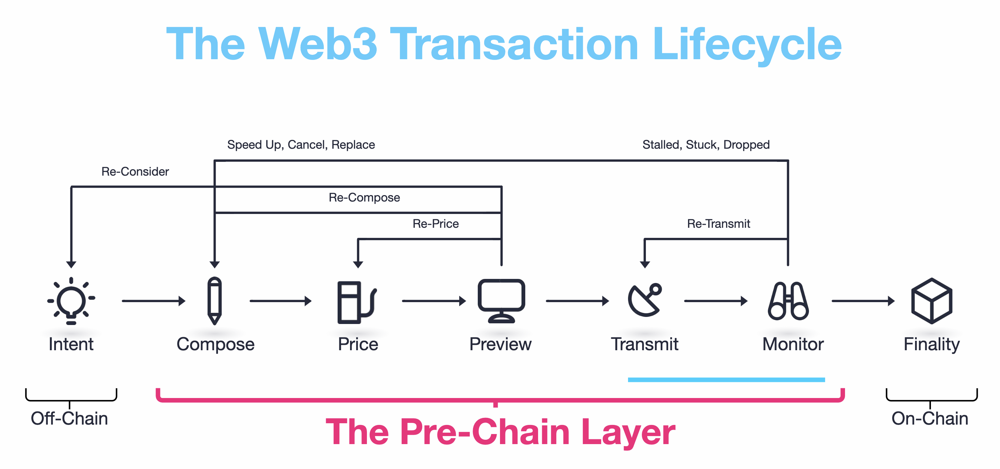

# Ethereum

## Basic Knowledge

- [What are Ethereum commitment levels? Latest, Safe, Finalized](https://www.alchemy.com/overviews/ethereum-commitment-levels)
  - [How The Merge Impacts Ethereum’s Application Layer](https://blog.ethereum.org/2021/11/29/how-the-merge-impacts-app-layer)
  - Conclusion
    - PoS 共识以后，出块时间是 12s；32 个 slots 组成一个 epoch，可能原因是需要选举 32 validator 进行出块
    - 在每个 epoch 中，理论上可以出 32 个块，12s一个，大概 6.4 min 一个 epoch；但是有小于 1% 的概率会出现无法在当前的 slot 出块的情况，比如被选择的 validator 故障下线了，或者由于网络等诸多因素导致提交不及时
    - PoS 生效后，对于 reorg block 的情况做了一些优化，提出了不同的 commitment level
      - latest：表示区块链最新的区块，不能保证这个块不被 reorg，使用的时候需要特别注意
      - safe: 表示已经收到 2/3 验证者的证明，相对安全，不太可能再发生重组，除非出现一些大规模的协调攻击，这个对攻击者本身带来的成本也是相当大的
      - finalized：表示最终确认的区块，极不可能发生重组，超过 2/3 的验证者已经接受这个区块，攻击者需要 burn 超过 1/3 的验证者抵押的 ether，几乎需要数百万的 ether，攻击成本巨大
- [Blocks in Ethereum](https://ethereum.org/en/developers/docs/blocks/)
  - Block size: 区块大小是受限制的，每个区块的目标是 1500 万 gas ，当然也会随着网络需求增加或者减少，但是最大不能超过 3000 万 gas；size 的大小是动态变化的，但有上限；容量上，上限是 12M，大部分块是 1 ～2 M
  - 出块时间 [Ethereum Average Block Time Chart](https://etherscan.io/chart/blocktime)

## Mempool

区块链创建了一个永久交易账本，一旦写入就不可以回滚；所以区块链需要一种机制来推测交易顺序让交易写入到区块当中，mempool 就是这样一种动态存储区域，这使得交易排序、交易费用优先级和一般区块构建成为可能。

被验证合法的交易会发送到 Ethereum 节点的 mempool，每个节点都有自己的 mempool，不同节点之间的 mempool 是通过网络进行同步的，由于网络的可靠性以及及时性，所以节点的 mempool 会有差异；同时，每个节点对于选取哪个交易打包到区块中也有不同的规则，比如最小的 gas price 和 mempool 大小限制等；

理想情况下，交易离开 mempool 的方式是被打包进区块，但是也可以因为加速和取消离开 mempool，还可以因为节点的 mempool 配置被丢弃。

交易流程中的 mempool 

- First, a user initiates a transaction from a Dapp or Wallet, such as sending funds to another account or contract
- Then the user signs that transaction with their Wallet
- The Wallet sends the signed transaction to a node, often called a gateway node, to get onto the Ethereum network (think Infura or Pocket)
- That node will verify the transaction is valid and add it to its mempool
- Since the node is connected to a group of peers, it broadcasts the transaction to other nodes.
- These peer nodes will receive the transaction, validate it, move it into their own mempool, and broadcast to additional peers, essentially replicating the transaction across the network
- Miners, as a specific kind of node, also receive the transaction from peers, validate it, and attempt to add it to a block
- Eventually, a successful miner adds a block with the transaction to the chain
- The new block is broadcast over the network
- As all nodes receive the new block from their peers, they see the included transaction and remove it from their mempool

8 Keys to the Mempool

1. Mempool  = Pre-Consensus
2. There is no single mempool
3. Each mempool has its own unique set of transactions
4. Each mempool has it own unique characteristics based on client type, configuration, peers
5. The mempool is mutable due to Replacement Transactions, including Speed Ups & Cancels
6. The mempool is an inconsistent "fabric" that grows lumpy during congestion / pressure
7. Your transaction completes in the mempool for block space
8. Mempool competition determines gas price and time to confirmation

Mempool 影响每一笔交易，user, trading strategy, wallet, dapp, protocol, L1, L2, bridge, miner, and validator.

Ref: https://www.blocknative.com/mempool-masterclass-signup#mempool

References

1. [What is the Mempool? - Your Intro to In-Flight Transactions](https://www.blocknative.com/blog/mempool-intro)

