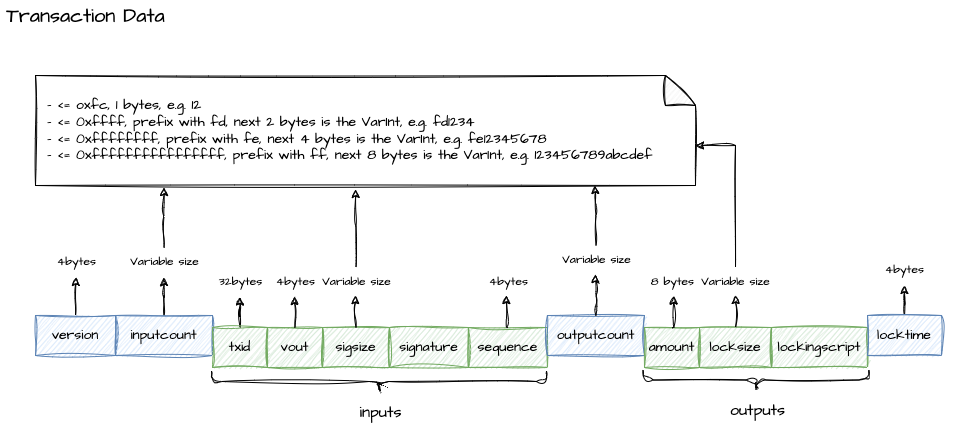

## Bitcoin Transaction

比特币历经很多年的发展，为了满足扩展性等的需要，也做了很多改进，交易结构就是其中的一部分。

比特币的账户模型是基于 `UTXO` 的，这个不做过多解释，而交易的基本结构是由输入 (inputs) 和输出 (outputs) 构成的，可以简单看下图


TODO image


要想清楚的了解各种地址和交易输出类型，我们需要以发展的眼光来了解，但首先我们需要理解一件事情，在 Bitcoin Network 中，一笔 UTXO 是如何确定可以被某个人花费，而不能被另外一个人花费？


1. P2PKH (P2PK)
2. P2SH
3. SegWit
4. TapRoot


| Tx Output Type  | Address Prefix | BIP   | Algo    | Address Length | Demo                                                         |
| --------------- | -------------- | ----- | ------- | -------------- | ------------------------------------------------------------ |
| P2PKH           | 1              | BIP44 | Base58  | 34             | 1MbeQFmHo9b69kCfFa6yBr7BQX4NzJFQq9                           |
| P2SH or P2WSH   | 3              | BIP49 | Base58  | 34             | 3EmUH8Uh9EXE7axgyAeBsCc2vdUdKkDqWK                           |
| P2WPKH (SegWit) | bc1q           | BIP84 | Bech32  | 42             | bc1qj89046x7zv6pm4n00qgqp505nvljnfp6xfznyw                   |
| P2TR (TapRoot)  | bc1p           | BIP86 | Bech32m | 62             | bc1p8denc9m4sqe9hluasrvxkkdqgkydrk5ctxre5nkk4qwdvefn0sdsc6eqxe |


每种类型地址生成过程


---

一笔 UTXO 怎么证明属于某个人，也就是说怎么花费这个 UTXO 呢？

如何构造一笔 raw transaction ? 如何签名一笔 raw transaction ?

手续费 (network fee) 如何设置？如果不设置 change address 会怎样 ？


1. 构造 raw transaction ?  createrawtransaction
2. 签名 raw transaction ? signrawtransaction
3. 广播 raw transaction ? sendrawtransaction


- getBlock 时获取解码后的 transaction 
- decoderawtransaction


交易数据，在发送交易时需要构造原始的交易数据，然后交给私钥去签名

Legacy Transaction



- 关于 version，说明看这里 [raw-transaction-format](https://developer.bitcoin.org/reference/transactions.html#raw-transaction-format), 目前支持 1 和 2
  - 2 表示应用 [bip68](https://github.com/bitcoin/bips/blob/master/bip-0068.mediawiki#specification) 规范
- 根据上面的构造方式生成交易的原始格式，通过 sha256(sha256(transaction raw format)) 获取到 txId
- Variable size, 表示一种可变大小的表示方式，具体看注释


SegWit Transaction

所谓见证数据，可以简单理解为签名数据，用于验证指定在 vins 中的 utxo 是可被花费的


生成地址的过程

version prefix                               Base58 result prefix

bitcoin address 0x00                        1

p2sh    0x05                                        3


比特币交易脚本以及脚本语言

比特币中的脚本是一种类似逆波兰表达式的基于堆栈的执行语言。

一个 UTXO 是怎么标记为属于某个地址，有如何能被被花费呢？答案就是锁定脚本和解锁脚本。

1. 锁定脚本 (scriptPubKey, or locking script): 放置了一个条件在 UTXO 上面，指定这笔输出必须满足条件才能花费
2. 解锁脚本 (ScriptSig, or witness script)：满足被锁定脚本在一个输出上设定的花费条件；解锁脚本是交易输入的一部分，往往含有用户比特币钱包私钥生成的数字签名


P2PKH - 对公钥哈希的付款，是一种类型，主要方式是验证公钥哈希和签名，以此来确定解锁脚本是否有效

```shell
 // 锁定脚本 scriptPubKey
 OP_DUP OP_HASH160 <Cafe Public Key Hash> OP_EQUALVERIFY OP_CHECKSIG
 // 解锁脚本
 <Cafe Signature> <Cafe Public Key>
 
 // 将解锁脚本和锁定脚本合并在一起，就构成了最终的验证脚本，比特币节点会运行这段脚本输出最终的结果是否是 TRUE
 <Cafe Signature> <Cafe Public Key> OP_DUP OP_HASH160 <Cafe Public Key Hash> OP_EQUALVERIFY OP_CHECKSIG
```

P2PK - 可能是最早出现的一种类型，直接使用公钥，而不是公钥哈希，安全性等方面不如 P2PKH


P2PKH 和 P2PK 两种类型，他们的地址都是有公钥直接推导出来的 (pubkey -> sha256 -> ripemd160 -> base58 编码)


P2SH - 是一种更复杂的类型，这种形式的脚本更加复杂、强大


隔离见证是一次比特币共识规则和网络协议的升级，基于 BIP-9 (2017年8月24日，区块高度 481824 激活)；见证表示满足了一种被放置在一个未使用的交易输出上的加密条件，使 UTXO 解锁后可被花费；和解锁脚本同意。

segwit 简单理解就是将某个特定输出的签名分离开，或将某个特定输入的脚本进行解锁；因此隔离见证就是一种结构性调整，将见证数据部分从一笔交易的 scriptSig 字段移除至一个伴随交易的单独的见证数据结构，客户端请求交易数据时可以选择要活着不要该部分伴随的见证数据

好处：交易延展性


#### transaction output types

The most common transaction output types are:

- **P2PK (Pay to Public Key)**: The first available type, locking funds using a public key.
- **P2PKH (Pay to Public Key Hash)**: The successor of P2PK, locking funds using the hash of a public key.
- Bare Multisig: An outdated approach to lock funds using multiple public keys.
- P2SH (Pay to Script Hash): Funds are locked using arbitrary Bitcoin script instructions. This type is primarily used for Multisig or wrapped SegWit (see below).
- P2WPKH (Pay to Witness Public Key Hash): The SegWit version of P2PKH. This type comes in two variants: for P2WPKH, spending conditions are directly encoded in the locking script; for nested P2WPKH, spending conditions are nested in a P2SH script.
- P2WSH (Pay to Witness Script Hash): The SegWit version of P2SH. This type comes in two variants: for P2WSH, spending conditions are directly encoded in the locking script; for nested P2WSH, spending conditions are nested in a P2SH script.
- P2TR (Pay to Taproot): Funds are locked using a 32-byte hash that is either (1) a public key, (2) a combination of multiple public keys, or (3) a script hash.
- Non-standard: Serves as catch-all for all outputs whose script instructions don't match any of the well-defined output types.


#### P2TR

Taproot 是比特币的一次重大升级，在区块高度 709632 激活这个特性，时间大致在 2021 年 11 月 12 号。

Taproot 的相关 BIPs：

1. Schnorr Signatures (BIP 340)
2. Taproot (BIP 341)
3. Tapscript (BIP 342)


https://bitcoin.design/guide/glossary/address/

https://blog.trezor.io/bitcoin-addresses-and-how-to-use-them-35e7312098ff

https://bitcoinops.org/en/newsletters/2019/04/16/

https://medium.com/geekculture/understanding-bitcoin-transaction-output-types-with-bigquery-c625643f2ab5

https://www.elliptic.co/blockchain-basics/understanding-bitcoin-transactions
